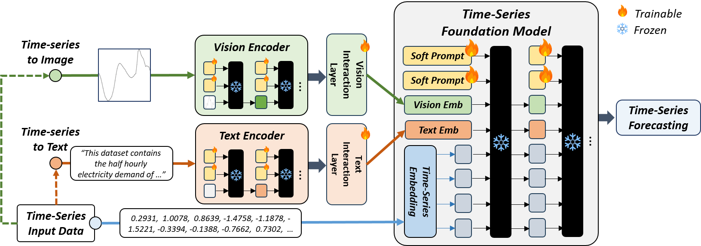
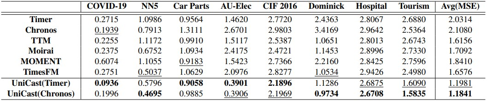
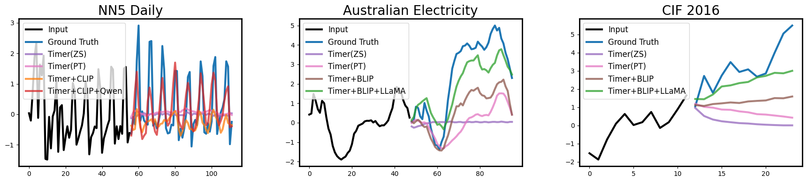

# UniCast: A Unified Multimodal Prompting Framework for Time Series Forecasting
Implementation of multimodal time-series forecasting framework in UniCast: A Unified Multimodal Prompting Framework for Time Series Forecasting

## Requirements
This project leverages two Time-Series Foundation Models: **Timer** and **Chronos**.  
Each model requires a separate Python environment:

- **Timer**: `python==3.10.16`
- **Chronos**: `python==3.11.11`

Other dependencies can be installed from the corresponding `requirements.txt` file for each model.

### Environment Setup

**Timer:**
```bash
conda create -n timer python=3.10.16
conda activate timer
pip install -r timer_requirements.txt
```

**Chronos:**

```bash
conda create -n chronos python=3.11.11
conda activate chronos
pip install -r chronos_requirements.txt
```

## Dataset Preparation
We use a subset of the evaluation dataset from **Chronos**.  
- All CSV files are stored in the `csv/` folder.  
- The `dataset/` folder contains a `create_dataset.py` script for each dataset.  

For converting time-series data into images, we follow the plotting approach used in **ViTST**.  

To generate the datasets, simply run:
```bash
bash create_dataset.sh
```
## Pretrained Models
UniCast utilizes:  
- **Time-Series Models**: Timer, Chronos  
- **Vision Encoders**: CLIP, BLIP  
- **Text Encoders**: Qwen, LLaMA  

Each model requires its corresponding pretrained configuration and weights.  
For each model, a `save_pretrained_model.py` script is provided in its respective folder.  

To download and save all pretrained models, simply run:
```bash
bash save_pretrained_model.sh
```

## Run
For each TSFM, separate shell scripts are provided for **training** and **testing**.  
These scripts are configured to iterate over different combinations of **vision encoders** and **text encoders**.

- To train:
```bash
bash train_multi_modal_tsfm.sh
```
- To evaluate:

```bash
bash test_multi_modal_tsfm.sh
```

## Evaluation Results

When compared with six baseline models, **UniCast** achieved better performance in a parameter-efficient manner while keeping the backbone frozen.

## Qualitative Analysis

The figure compares four configurations: **TSFM Zero-Shot**, **TSFM with Prompt Tuning**, **TSFM with Vision Encoder**, and **TSFM with both Vision and Text Encoders**. 
It shows that adding more modalities enables the model to capture patterns more effectively.